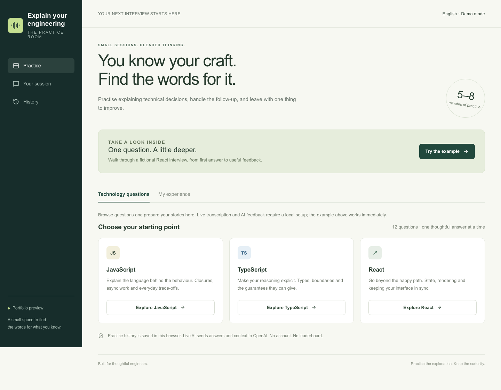
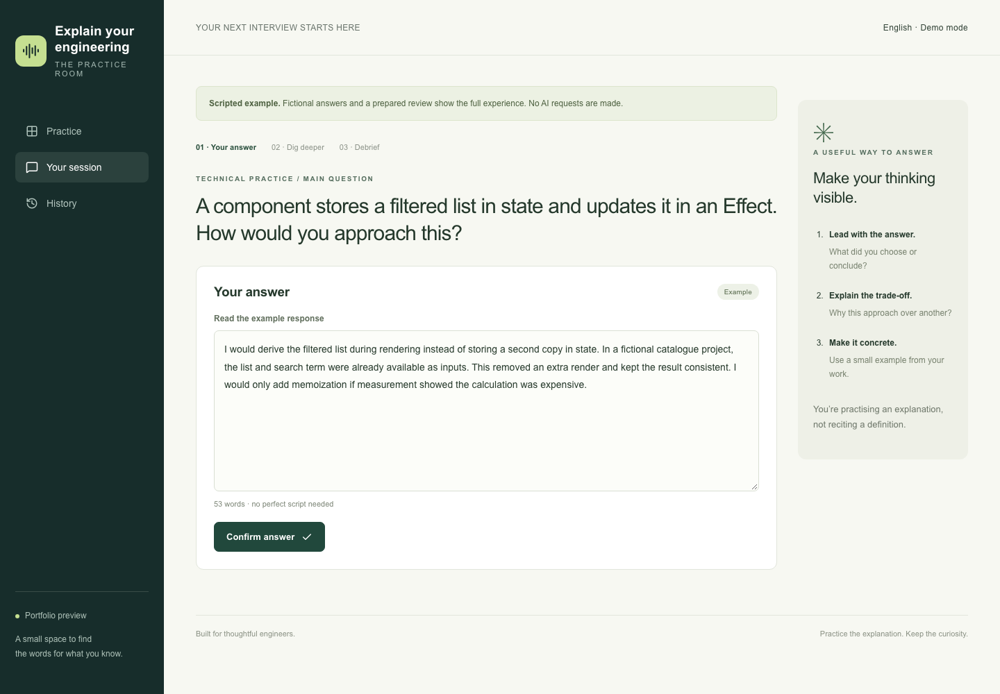

# Explain Your Engineering

**You know your craft. Find the words for it.**

A technical interview practice room for engineers who want to explain decisions clearly, handle a thoughtful follow-up, and learn from the next attempt.



Choose **Technology** for twelve JavaScript, TypeScript and React questions, or **My experience** to practise a decision from your own work. Record or type an answer, correct the transcript, answer one technical follow-up, and review communication and technical reasoning separately.

[Watch the scripted walkthrough](docs/media/example-walkthrough.webm) · [Architecture and decisions](docs/architecture.md) · [Verification status](docs/verification.md)

## Two ways to explore

- **Scripted example:** a fictional React interview with prepared answers and feedback. Works without an account or API key; labelled throughout. It does not evaluate arbitrary text.
- **Personal practice:** run locally with your own server-side OpenAI key for real transcription, follow-ups and feedback. The public configuration disables all live AI endpoints.

Cards, transcripts and reviews are saved in this browser. Live practice sends selected context and confirmed answers to OpenAI. There is no account, cross-device sync, leaderboard or hiring score. Audio is available for playback only during the current answer and is not stored in history.

## Run locally

Node.js 22 or later is required; CI uses Node.js 24.

```bash
npm ci
cp .env.example .env.local
npm run dev
```

Open http://127.0.0.1:3000. The example works immediately. For personal practice, edit `.env.local`:

```dotenv
AI_ENABLED=true
OPENAI_API_KEY=your-own-key
TRANSCRIPTION_MODEL=gpt-4o-mini-transcribe
FEEDBACK_MODEL=gpt-5-mini
```

Restart the dev server after changing environment variables. API access is billed separately by the provider. Never prefix the API key with `NEXT_PUBLIC_`, paste it into the browser, or commit it.

Transcribe sends your recording to OpenAI. Follow-up and review requests send the confirmed transcripts and selected context. Avoid confidential project details. The application does not log or persist these payloads on the server; provider-side handling is governed by [OpenAI's data controls](https://developers.openai.com/api/docs/guides/your-data). Deleting browser history does not request deletion from the provider.

## What makes the practice useful

- A curated question bank with editorial criteria, valid alternatives and primary-source references.
- A follow-up grounded in the first answer, rather than another unrelated quiz question.
- Editable transcripts before analysis: technical terms are easy to misrecognise.
- Observations anchored to exact answer quotations, with a concrete next action.
- Separate feedback on communication and technical reasoning. Model feedback is fallible and should be checked against the linked sources.
- Snapshots keep past attempts intact after their source story is edited or deleted.



## Engineering choices

**Next.js App Router + TypeScript + Zustand + CSS Modules + Zod.**

Next.js keeps the UI and three server endpoints together. A client Provider creates an isolated Zustand store; explicit actions control the practice lifecycle. Persistence restores after mounting to avoid mismatched server/client HTML. The recorder owns its media stream, timer and object URL outside the store.

Only text and domain data are persisted. Stored data is versioned and validated; corrupt storage is reported and protected from automatic overwrites. Cross-tab conflicts pause saving instead of overwriting newer browser data; practise in one tab at a time. A request token prevents late results from changing a cancelled or replaced session.

Server-only question criteria and API keys never enter client props. Structured AI output is validated again: quotations must occur in the stated answer and source IDs must belong to that question. These checks validate the evidence format, not the truth of every model observation.

## Verify

```bash
npm run typecheck
npm run lint
npm test
npm run build
npx playwright install chromium webkit
npm run test:e2e
```

Unit/component tests cover state isolation, invalid transitions, persistence failure, quote validation, disabled APIs and microphone denial. Browser tests cover both practice modes, reload, history and retry with deterministic responses. Chromium audio tests use a generated MediaStreamTrackGenerator audio with the real browser MediaRecorder; they do not prove a physical microphone works. WebKit tests do not substitute for Safari device testing.

Current evidence and remaining live checks are listed in [verification status](docs/verification.md).

## Deploy a public preview

Import this repository into Vercel as a Next.js project. Leave `AI_ENABLED=false`, do not add an OpenAI key, and retain the default build settings. Verify that all three POST endpoints return `403` before sharing the URL. No database is required.

Public live-AI access is outside this version's scope: it would require authentication, abuse controls and a deliberate spending limit. The local server binds to `127.0.0.1` by default.

## Project background

A personal portfolio project shaped around a real interview-preparation need. Anna selected the product direction, Next.js and Zustand; implementation was developed with AI assistance. Small feature commits and staged review make the decisions and validation inspectable.

This is a learning project, not a validated interviewer or a production hiring system. It does not grade accent, predict hiring outcomes or verify personal career claims.
