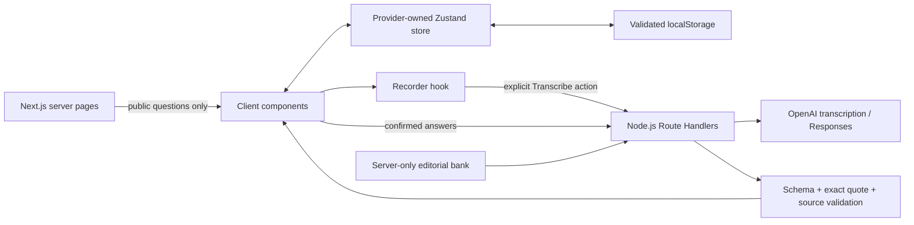

# Architecture and trade-offs

## Why Next.js?

The product needs a server boundary for audio processing and model credentials. Route Handlers keep this boundary in the same project as the UI without an additional Express server. Interactive practice remains in client components; server rendering is not forced onto microphone access or browser history.

## Why Zustand?

Practice, experience cards and history share client data. A provider-owned store offers selective subscriptions, named actions and controlled persistence. It is not a mutable process-wide server singleton. Transient media resources and request controllers stay outside persisted state.

## Durable and transient state

Durable: versioned cards, the current text draft, completed attempts, context snapshots and review data. Transient: microphone streams, recordings, timers, API requests and errors. Rehydration does not restart requests. The UI waits for restoration before exposing editable data.

The schema is currently version 1. Unsupported versions and corrupt data are reported rather than silently coerced. Browser storage is limited and local to the origin. Export and cross-device sync are future possibilities, not present guarantees.

## Request lifecycle

A confirmed answer can request a follow-up; a confirmed second answer can request feedback. Each request receives a unique token. Cancellation, editing or a new session invalidates its result. Editing the first answer clears the follow-up and second answer. Completed history entries are independent copies.

## AI boundary

Question IDs and versions select trusted editorial context server-side. Experience cards and transcripts remain untrusted input. The model receives explicit coaching instructions and returns a constrained structure. The server checks quote membership and reference IDs before publishing a review. Semantic correctness, useful feedback and robust resistance to prompt manipulation still require empirical evaluation.

No model fallback silently changes cost or behaviour. Provider failure leaves the user's answer intact and offers an explicit retry.

## Public demo

The fixture is a product walkthrough, not a hidden replacement for an AI service. Its controls load known fictional answers; it never analyses personal input. Public AI endpoints reject requests independently of the UI. Personal practice uses local server configuration.

## What to explain in an interview

1. Why the browser owns practice history in this version, and what changes with accounts.
2. How post-mount hydration avoids a different first client render.
3. How late responses become harmless and what cancellation can and cannot guarantee.
4. Why validating JSON is insufficient to validate a technical review.
5. Why microphone resources do not belong in persistent state.

## Concurrent tabs

Each storage adapter remembers the exact envelope it read or last wrote. Before a write, it compares the current envelope and pauses saving if another tab changed it. Current edits remain in memory with a visible warning. Web Locks serialize this comparison and write in supported browsers; the synchronous comparison remains a best-effort fallback elsewhere. This is conflict protection, not collaborative editing. Use one practice tab at a time.

## UI availability and saving

The server passes AI availability to the session view. Public mode supports written drafts and the scripted example; recording and live-analysis actions are unavailable. Pages read this setting at request time.

Experience saves await the storage adapter’s pending Web Lock write before the form closes. The form remains disabled during this short operation; errors preserve the draft. Browser tests wait for durable persistence before intentionally reloading a completed session.

## UI components

Ant Design provides the standard light theme, forms, navigation, alerts and confirmations. The root AntdRegistry collects server-rendered styles; a client ConfigProvider and App provide component configuration and context-aware dialogs. CSS Modules only arrange the page layout.

Confirmation dialogs resolve asynchronously. Launchers await the result before navigating, and unmounting cancels pending confirmations. A late transcript checks the current session and answer again before replacing text.
